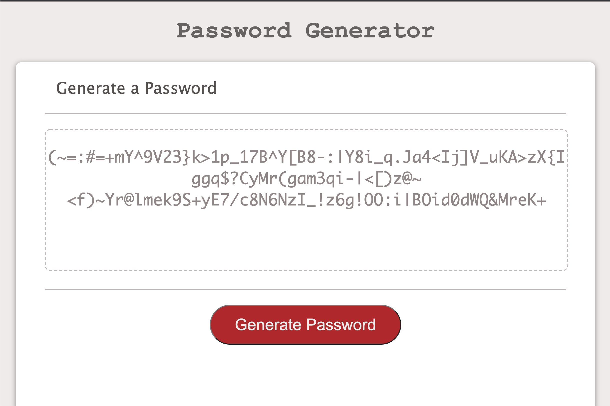

# Password Generator


Password Generator is a browser app that allows you to generate a custom password using a user-specified length and character types.

# User-Selected attributes

```bash
Length: 1-128 characters
Lower Case Letters: true/false;
Upper Case Letters: true/false;
Symbols: true/false;
Numbers: true/false;
```
# Appearance




## Pull Permission

Feel free!


## License
[MIT](https://choosealicense.com/licenses/mit/)